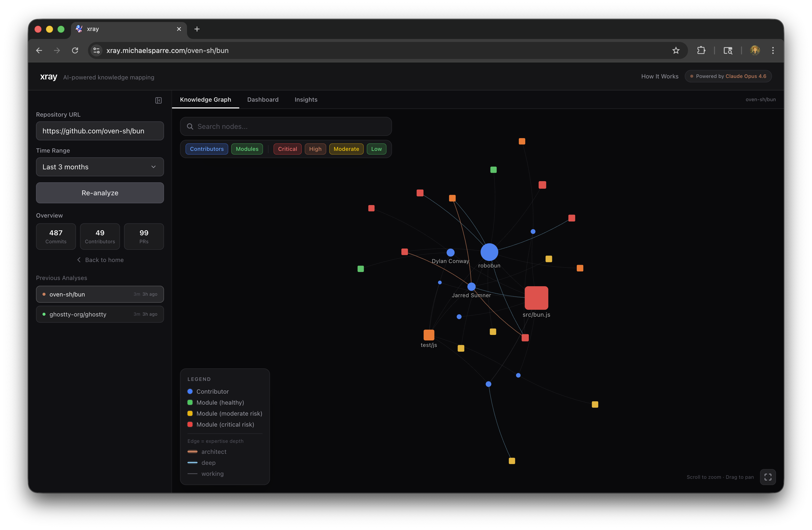

# xray

**Reveal hidden knowledge structures in your engineering team.**

xray analyzes GitHub repositories to uncover invisible team dynamics: who *really* owns the code, where bus factor risks lurk, and what patterns emerge from how your team reviews each other's work.

The key insight: **Claude reads actual code diffs** to understand expertise depth — not just commit counting. It classifies whether a contributor made surface-level changes or architect-level decisions, and whether reviews are thorough mentoring or rubber stamps.



**[Watch the demo video](https://youtu.be/ddSjYo4Gc2A)**

## How It Works

1. **Ingest** — Clones the repo and fetches git history, blame data, and PR metadata via `gh` CLI
2. **Analyze** — Claude (Opus) reads sampled PR diffs to classify each contributor's expertise depth per module, and evaluates review quality on merged PRs
3. **Compute** — Calculates bus factor scores using a Gini coefficient over blame ownership concentration
4. **Detect** — Extended thinking identifies non-obvious patterns: ghost architects, review rings, hidden experts, knowledge silos
5. **Visualize** — Interactive knowledge graph + dashboard surfaces the results

## Features

- **Knowledge Graph** — Force-directed visualization of contributor-to-module relationships, weighted by expertise depth
- **Bus Factor Analysis** — Gini coefficient-based ownership concentration per module
- **AI Code Analysis** — Claude reads PR diffs and classifies expertise depth (surface / working / deep / architect)
- **AI Review Quality** — Classifies review quality (rubber stamp / surface / thorough / mentoring)
- **Pattern Detection** — Extended thinking finds non-obvious insights across the full dataset

## Prerequisites

- [uv](https://docs.astral.sh/uv/) (Python package manager)
- Node.js 18+
- [`gh` CLI](https://cli.github.com/) (authenticated via `gh auth login`)
- [Anthropic API key](https://console.anthropic.com/)

## Setup

```bash
git clone https://github.com/micsparre/xray.git
cd xray

# Backend
uv sync

# Frontend
cd frontend && npm install && cd ..

# Environment
cp .env.example .env
# Edit .env and add your ANTHROPIC_API_KEY
```

## Run

```bash
# Terminal 1 — Backend
PYTHONPATH=. uv run uvicorn backend.main:app --host 0.0.0.0 --port 8001

# Terminal 2 — Frontend
cd frontend
npm run dev -- --port 5174
```

Open **http://localhost:5174**, enter a GitHub repo URL, and go.

Pre-analyzed demos (React, Flask, Bun, Ghostty) are available via the Quick Demo buttons.

## Private Repos

xray uses the `gh` CLI for all GitHub API calls (PRs, blame, repo metadata). To analyze private repositories:

```bash
# Option A: Log in interactively (token is stored by gh)
gh auth login

# Option B: Set a token directly in your .env
GH_TOKEN=ghp_your_personal_access_token
```

The token needs `repo` scope. Everything runs locally — no data leaves your machine except Anthropic API calls for code analysis.

## Configuration

Key settings in `.env` (all optional except `ANTHROPIC_API_KEY`):

| Variable | Default | Description |
|---|---|---|
| `ANTHROPIC_API_KEY` | — | **Required.** Your Anthropic API key |
| `GH_TOKEN` | — | GitHub token for private repo access |
| `DEFAULT_MONTHS` | `6` | Months of git history to analyze |
| `MAX_PRS_CODE_ANALYSIS` | `30` | PRs sampled for AI code analysis |
| `MAX_PRS_REVIEW_ANALYSIS` | `20` | PRs sampled for AI review analysis |
| `MAX_BLAME_FILES` | `30` | Files sampled for blame ownership |
| `MAX_REPO_SIZE_MB` | `500` | Reject repos larger than this before cloning |

## License

Apache License 2.0 — see [LICENSE](LICENSE) for details.
